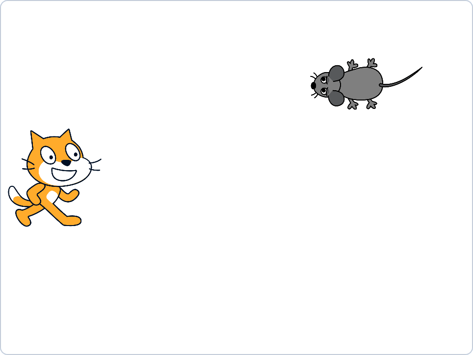
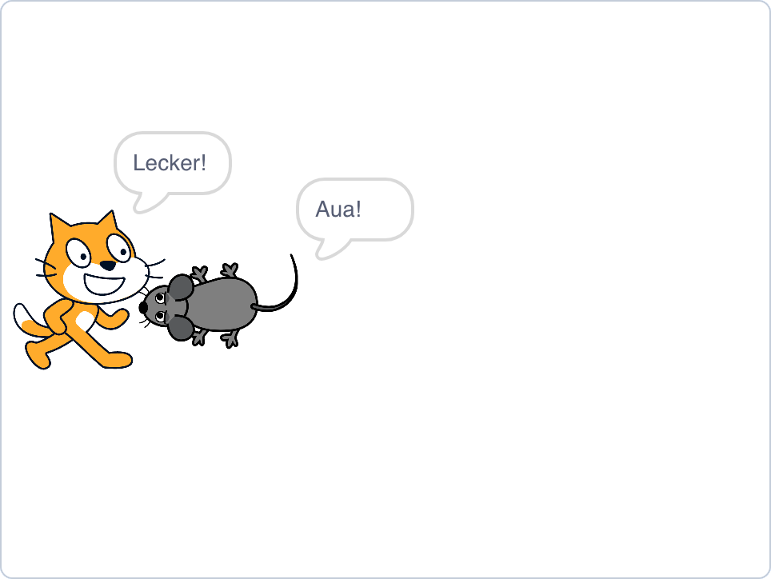
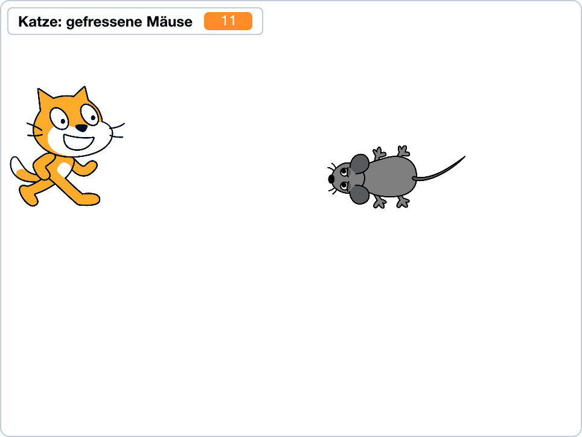
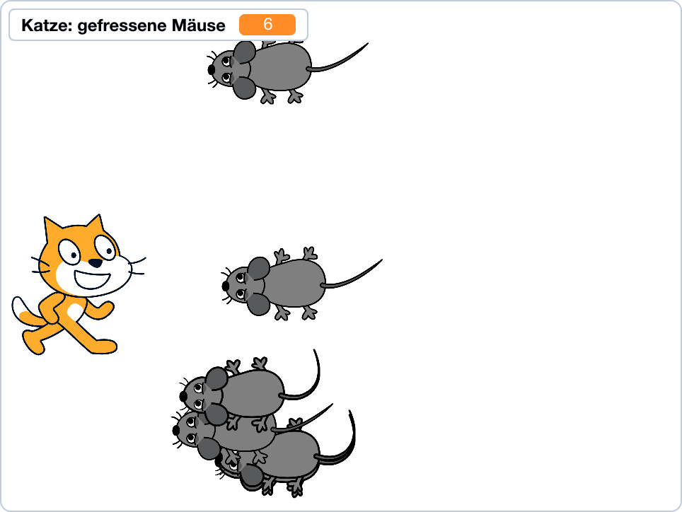

# Scratch 3 Kids Workshop

Übungen mit schrittweisen Beispiel-Lösungen für einen zwei- bis dreistündigen Scratch-Workshop.
Zielgruppe sind Grundschulkinder in der 4. Klasse.

Scratch 3.6.0 kann als [Desktop](https://scratch.mit.edu/download)\-Version heruntergeladen
oder [online](https://scratch.mit.edu/projects/editor/) im Browser genutzt werden.

## Übung "Katz und Mäuse"

Als allererstes: Fertiges Spiel kurz vorführen! :-)

### Flipchart (aufmalen)

- x/y Koordinatensystem (Mitte 0,0) \
  (x +/- 190, y +/- 125, Sprite Katze)
- ungefähre Spielidee
- Katze anfangs an (-185,0)

### Programmieren (vormachen + nachmachen)

Jeden Schritt starten und live zeigen, was programmiert werden soll!

#### Schritt 1:
  - Erstes Sprite hoch/runter bewegen (Cursortasten) / "Katze" (Name setzen)
  - nur bis zum Bildschirmrand oben/unten
  - links auf der Stage

#### Schritt 2:
  - Zweites Sprite von rechts nach links durchlaufen lassen (vertikal zentriert) / "Maus" (Name setzen)
  - Kostüm / beide spiegeln, einen verschieben (dafür alles markieren)
  - nur bis zum Bildschirmrand links
  - wieder am rechten Rand erscheinen lassen
  - an zufälliger y-Position erscheinen lassen

#### Schritt 3:
  - Maus startet an zufälliger y-Position
  - Wenn Maus-Sprite das Katzen-Sprite berührt: \
    Katze sagt "Lecker!", Maus sagt "Aua!" (Text) für 0.5s
  - Maus startet sofort wieder rechts
  - Voice "Lecker" aufnehmen und abspielen

#### Schritt 4:
  - Zähler, wieviele Mäuse gefressen wurden

#### Schritt 5:
  - alle Mäuse, die den linken Rand erreichen, kommen rechts doppelt wieder rein (Clone)

#### Mögliche Ausbaustufen

- Abwärtszähler, wieviele Mäuse die Katze durchlassen darf (5); bei 0 Spielende
- Maus mit zufälliger Geschwindigkeit

## Optional: Übung "Pong" (alleine bzw. zusammen mit Mentor)

- 2 Player-Sprites am linken bzw. rechten Bildschirmrand
- mit unterschiedlichen Tasten hoch/runter bewegen
- Ball-Sprite, der sich frei im Raum bewegt & am Bildschirmrand abprallt
- und an beiden Player-Sprites abprallt
- Ende, wenn das Ball-Sprite den linken oder rechten Rand erreicht
- Ausbau: #Leben (3) pro Player, die runtergezählt werden; Spielende, wenn ein Counter 0
- Alternativ: Gewinnpunkte pro Player zählen
