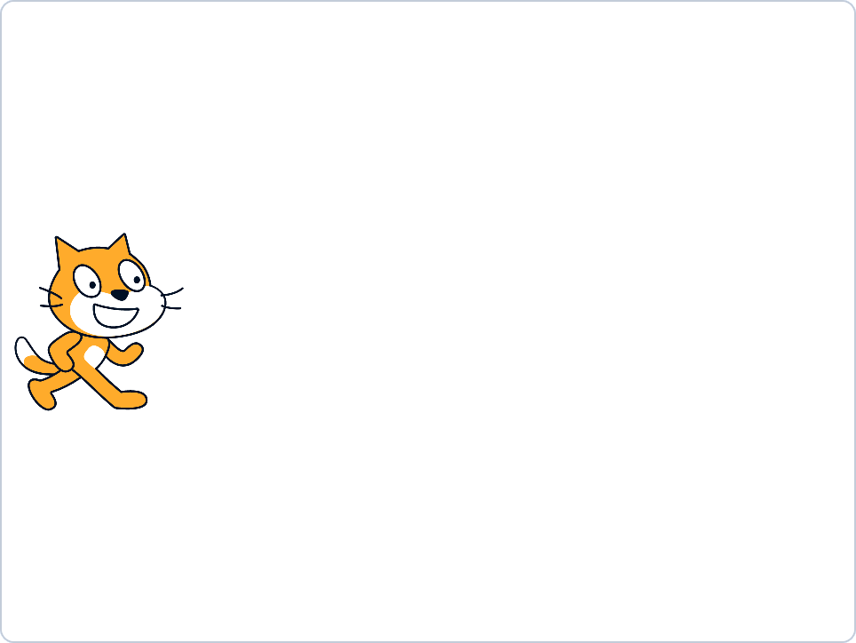

# Scratch 3 Kids Workshop

Übungen mit schrittweisen Beispiel-Lösungen für einen zwei- bis dreistündigen Scratch-Workshop.
Zielgruppe sind Grundschulkinder in der 4. Klasse.

Scratch 3.6.0 kann als [Desktop](https://scratch.mit.edu/download)\-Version heruntergeladen
oder [online](https://scratch.mit.edu/projects/editor/) im Browser genutzt werden.

## Übung "Katz und Mäuse"

Als allererstes: Fertiges Spiel kurz vorführen! :-)

### Flipchart (aufmalen)

- x/y Koordinatensystem (Mitte 0,0) \
  (x +/- 190, y +/- 125, Sprite Katze)
- ungefähre Spielidee
- Katze anfangs an (-185,0)

### Programmieren (vormachen + nachmachen)

Jeden Schritt starten und live zeigen, was programmiert werden soll!

#### Schritt 1:
  - Erstes Sprite hoch/runter bewegen (Cursortasten) / "Katze" (Name setzen)
  - nur bis zum Bildschirmrand oben/unten
  - links auf der Stage

#### Schritt 2:
  - Zweites Sprite von rechts nach links durchlaufen lassen (vertikal zentriert) / "Maus" (Name setzen)
  - Kostüm / beide spiegeln, einen verschieben (dafür alles markieren)
  - nur bis zum Bildschirmrand links
  - wieder am rechten Rand erscheinen lassen
  - an zufälliger y-Position erscheinen lassen

#### Schritt 3:
  - Maus startet an zufälliger y-Position
  - Wenn Maus-Sprite das Katzen-Sprite berührt: \
    Katze sagt "Lecker!", Maus sagt "Aua!" (Text) für 0.5s
  - Maus startet sofort wieder rechts

#### Schritt 4:
  - Zähler, wieviele Mäuse gefressen wurden

#### Schritt 5:
  - alle Mäuse, die den linken Rand erreichen, kommen rechts doppelt wieder rein (Clone)

#### Mögliche Ausbaustufen

- Klänge "Lecker" und "Aua" aufnehmen und abspielen (evtl. schon nach Schritt 3)
- Abwärtszähler, wieviele Mäuse die Katze durchlassen darf (5); bei 0 Spielende
- Maus mit zufälliger Geschwindigkeit

## Optional: Übung "Ping Pong" (alleine bzw. zusammen mit Mentor)

#### Mögliche Schritte

- Figur für linken Schläger malen
- per Tastatur (z.B. "q" und "a") auf- und abbewegen
- Figur für Ball aussuchen und passend skalieren
- in der Mitte mit zufälliger Drehrichtung starten
- bei Programmstart fortlaufend den Ball bewegen und vom Rand abprallen lassen
- wenn der Ball den linken Schläger berührt, Klang "pop" abspielen und Drehrichtung negieren (auf 0-Richtung setzen)
- rechten Schläger duplizieren und anpassen (Bildschirmposition, Tasten z.B. "p" und "l")
- Variablen für Punkte (Spieler 1 / Spieler 2) ergänzen und auf der Spielfläche positionieren
- wenn der Ball zu weit links ist, Punkt für Spieler 2 vergeben und den Ball neu in der Mitte starten
- wenn der Ball zu weit rechts ist, Punkt für Spieler 1 vergeben und den Ball neu in der Mitte starten

#### Mögliche Lösung

